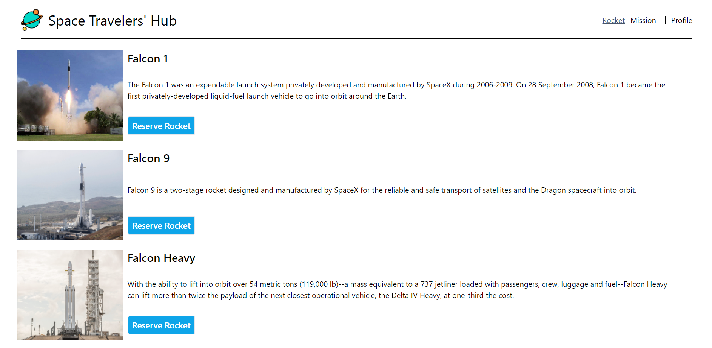
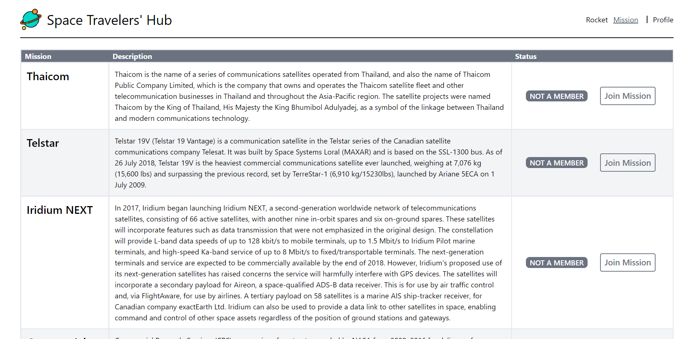

# Space-Travelers

> **Space Travelers' Hub** is a web application that allows people to reserve spaceships and rockets and get active in doing outerspace missions.

## Built With

- TailwindCss
- React
- Redux
- Redux-thunk
- React-router
- Redux-logger (tooling)
- React testing library (unit testing)
- SpaceX API

## Milestones

- [x] Milestone 1: **React app setup with redux using the duck pattern**
- [x] Milestone 2: **Set up the app navigation using react-router**
- [x] Milestone 3: **Create an API layer using the SpaceX API**
- [x] Milestone 4: **Create the Redux store including the action creators and the reducers**
- [x] Milestone 5: **Integrate the redux store into the app and display the data**
- [x] Milestone 6: **Implement JoinMission and ReserveRocket functionalities**
- [x] Milestone 7: **Display the user data in the Profile page**

## Images

## Getting Started

**Prerequisites:** A Web Browser (preferably FireFox or Chrome)

### **Option 1**

#### Use the live Website

[Netlify Demo](https://jocular-fudge-743992.netlify.app)

### **Option 2**

#### Set up your own copy locally

- Clone [the GitHub Repository](https://github.com/adriancsm/Space-Travelers)
- Go to the Project folder `cd Space-Travelers`
- Run `npm install` to install the _dependencies_
- Run `npm start` to run the live server.

## About the authors

👤 **Adrian Cosmin**

- GitHub: [@AdrianCSM](https://github.com/AdrianCSM)
- Twitter: [@CosminAdriann](https://twitter.com/CosminAdriann)
- LinkedIn: [Adrian Cosmin](https://www.linkedin.com/in/gheorghita-cosmin-adrian-b7781122a/)

👤 **Alfred Bisimwa**

- GitHub: [@Alfred Biswima](https://github.com/Alfredbis29)
- Twitter: [@AlfredBisimwa1](https://twitter.com/alfredbisimwa1)
- LinkedIn: [Alfred Bisimwa](https://www.linkedin.com/in/alfred-bisimwa-0501a81a8/)

## Show your support

Give a ⭐️ if you like this project!

## 📝 License

This project is under the [MIT](./LICENSE) license.
